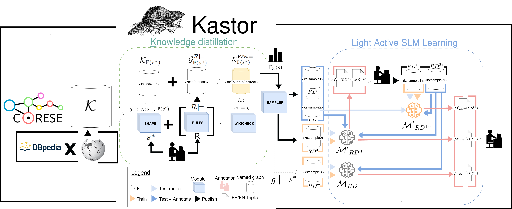

# Kastor - Fine-tuned Small Language Models for Shape-based Active Relation Extraction
  


:tada: Kastor was accepted at the Research Track of [ESWC 2025](https://2025.eswc-conferences.org/)

If you use the code or cite our work, please reference this one as follows :
```
@inproceedings{ringwald:hal-05078493,
  TITLE = {{Kastor: Fine-tuned Small Language Models for Shape-based Active Relation Extraction}},
  AUTHOR = {Ringwald, Celian and Gandon, Fabien and Faron, Catherine and Michel, Franck and Akl, Hanna Abi},
  URL = {https://hal.science/hal-05078493},
  BOOKTITLE = {{Extended Semantic Web Conference 2025}},
  ADDRESS = {Portoroz, France},
  YEAR = {2025},
  MONTH = Jun,
  KEYWORDS = {Relation Extraction Small Language Models Structured output ; Relation Extraction ; Small Language Models ; Structured output},
  PDF = {https://hal.science/hal-05078493v1/file/Kastor__Fine_tuned_Small_Language_Models_for_Shape_based_Active_Relation_Extraction_AuthorVersion.pdf},
  HAL_ID = {hal-05078493},
  HAL_VERSION = {v1},
}
```

This gathers all the material to reproduce the experiments or to re-use Kastor, which could be easily extended to create a new RDF-pattern-based extractor focused on a new given SHACL shape. 
The produced KB is available on [Zenodo](https://zenodo.org/records/14382674) and could be easily queried or used to produce new samples.

## Full pipeline


0- Initialise a KB> see [corese instructions](./corese/)
DESIGN A SHAPE AND LOAD a DBpediaxWikipedia dual base 
> The two steps are explained in detail in the Kstor [code directory](./kstor/), they are:

1- Knowledge Distillation: Filter/consolidate the KB to get samples from a characterized example-specific pattern distribution  
2- Light Active SLM Learning: learn models and iterate over it to build ground-truth and gold text-to-rdf extractors


## Test the produced models 

The produced models are available here, including the tokenizer as well as the last checkpoint obtained from the finetuning for M(DR-),  M'(DR0), M'(DR1+): https://zenodo.org/records/14498940
You can easily test the resulting extractor via [this notebook](./Test_models.ipynb)
