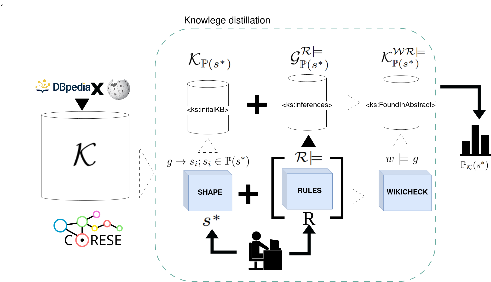

# KAStor - Fine-tuned Small Language Models for Shape-based Active Relation Extraction
  


## Knowledge distillation

Our framework is based on [Corese](https://github.com/Wimmics/corese), a Software platform for the Semantic Web of Linked Data. 
The software could be deployed locally via a  [JAR software](https://github.com/Wimmics/corese/releases/download/release-4.5.0/corese-server-4.5.0.jar) which is using the Jena TDB as backend.

To load the resulting KB, please first load the [Kastor datadump available on Zenodo](https://zenodo.org/records/14382674): 
```
tdbloader --loc /path/for/database ...input files ... 
```
And then run the CORESE datastore with 
```
 java -Xmx10g -jar corese-server-4.5.0.jar -init "config.properties"
```


## Light Active SLM learning
