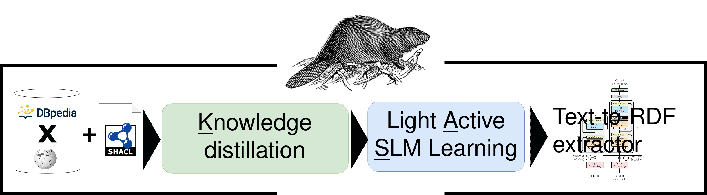
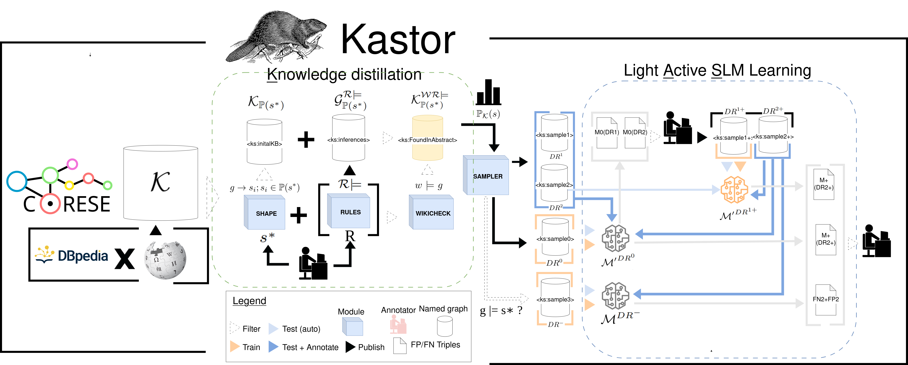

# Kastor - Fine-tuned Small Language Models for Shape-based Active Relation Extraction
  

This anonymous repository is related to the submission at the ESWC2025 research track "Kastor: Fine-tuned Small Language Models for Shape-based Active Relation Extraction" 
It gathers all the material to reproduce the experiments, which could be easily extended to create a new RDF-pattern-based extractor focused on a new given SHACL shape. 
The produced KB is available on [Zenodo](https://zenodo.org/records/14382674) and could be easily queried or used to produce new samples.

## Full pipeline

0- Initialise a KB> see [corese instructions](./kstor/corese/)
DESIGN A SHAPE AND LOAD a DBpediaxWikipedia dual base 

> The two steps are explained in detail in the Kstor [code directory](./kstor/kstor/), they are:

1- Knowledge Distillation: Filter/consolidate the KB to get samples from a characterized example-specific pattern distribution  
2- Light Active SLM Learning: learn models and iterate over it to build ground-truth and gold text-to-rdf extractors

## Test the produced models 

The produced models are available here, including the tokenizer as well as the last checkpoint obtained from the finetuning for M(DR-),  M'(DR0), M'(DR1+): https://zenodo.org/records/14498940
You can easily test the resulting extractor via [this notebook](../Test_models.ipynb)
