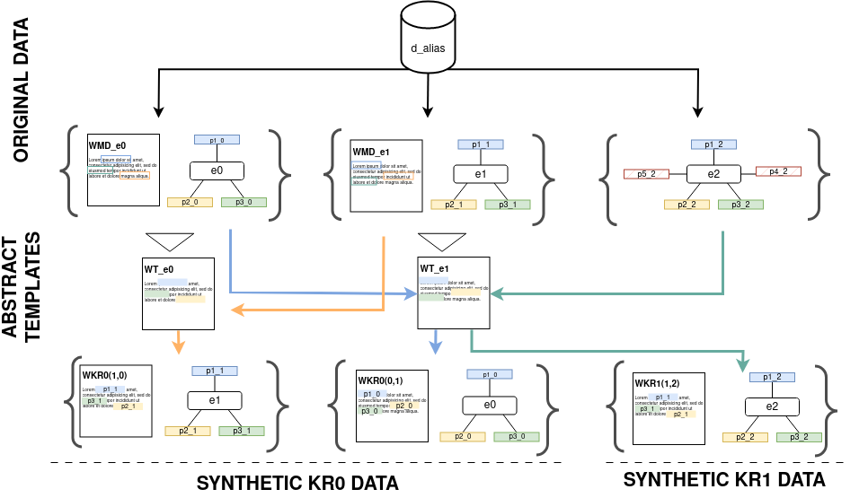

# 👶 Augmentation strategies

We detail in this document the algorithms implemented to reach a **sufficient exposure per property**

## 1. Template-based synthetic generation
  

We propose two strategies to augment data related to rare properties. These two strategies rely on the articles in markdown and their associated distilled graph. 
Both methods use a random set of entities to first construct a set of article templates WT, which are later filled with data from other entities to generate synthetic
examples.
In both strategies, we start with reduced set of entities describing a given rare property, in the figure bellow we took the example of the dbo:alias property, forming the subset $d_{alias}$.
However, the two approaches differ in the way they select entities to populate the templates: 
1. The first method $KR0$ is built by selecting
two random entities from dalias that share exactly the same set of
properties. From each seed $(e_i ,e_j )$, we generate two new synthetic
abstracts $WKR0_{(j,i)}$ and $WKR0_{(i,j)}$ .
2. The second method $KR1$ select random a seed entity $e_i$ then searching
for an other entity $e_j$ described by at least all the properties of $e_i$,
along with some additional ones. A new synthetic abstract WKR1_{(j,i)} is then generated by inserting all the properties of $e_j$, contained in
$e_i$ , into the template abstract $WT_i$.

In both cases, multiple synthetic abstracts may be created for the same entity from $d_{alias}$. 
To avoid overfitting and ensure uniqueness, we append a random sequence of 8 characters to each DBpedia URI referring to the subject. This modification is applied both in the input prompt and the linearized
graph during training. 
### KR0 - same pattern level remplacement

#### Pseudo-Algo
**Input:** 
* a set $Seed_{data}$ containing $n$ entities
* a prefined the number $N$ of synthetic examples that must be generated
* a Knowledge base $\mathcal{K}$  

**Output:** a set $Synth_{data}$ of $N$ generated quadruple $(e_i,e_j,g_j,WKR0_{(i,j)})$  

-- **Begin** 
1. Initiliaze the dictionary $Patt_{real}= \\{\\}$
2. Compute the number of realization in $Seed_{data}$ of each patterns:  
**For each** $e_i$ in $Seed_{data}$:  
├── get the associated graph-text couple $(g_i,t_i)$ associated to $e_i$ in $\mathcal{K}$  
├── define $Patt_i$ as the ordered set of properties described in $g_i$  
├── **If** $Patt_i$ not in $Patt_{real}$: $Patt_{real}\[Patt_i\]=0$  
└── $Patt_{real}\[Patt_i\]=+1$  
4. Filter the dictionnary $Patt_{real}$ by keeping only the pattern: $Patt_{real}\[Patt_i\]>= 2$ and save the result in $Patt_{real}2$
5. Initialise the set of the synthetic example $Synth_{data}$
6. Run the generation:

**While** $|Synth_{data}|$ < $M$:  
├── Select a random $Patt_p$ from $Patt_{real}2$  
├── Select a entity $e_i$ related to a graph $g_i$ following $Patt_p$  
├── Select a entity $e_j$ related to a graph $g_j$ following $Patt_p$ with $e_j$ !=  $e_i$   
└── **If** $(e_i,e_j)$ and $(e_j,e_i)$ do not exist in $Synth_{data}$:  
&nbsp;&nbsp;&nbsp;&nbsp;&nbsp;&nbsp;&nbsp;&nbsp;&nbsp; ├── Create a template $WT_i$ from $WMD_i$ the abstract associated to $e_i$ in $\mathcal{K}$, 
&nbsp;&nbsp;&nbsp;&nbsp;&nbsp;&nbsp;&nbsp;&nbsp;&nbsp;&nbsp;&nbsp;|  &nbsp;&nbsp;&nbsp;&nbsp;&nbsp;&nbsp; &nbsp;&nbsp;&nbsp; by masking each properties values of $g_i$, the graph associated to $e_i$, in $WMD_i$  
&nbsp;&nbsp;&nbsp;&nbsp;&nbsp;&nbsp;&nbsp;&nbsp;&nbsp; ├──  Fill the template $WMD_i$ with the data of $g_j$ the graph associated to $e_j$ in $\mathcal{K}$ this new abstract is named $WKR0_{(i,j)}$   
&nbsp;&nbsp;&nbsp;&nbsp;&nbsp;&nbsp;&nbsp;&nbsp;&nbsp; ├──  Add $(e_i,e_j,g_j,WKR0_{(i,j)})$ in $Synth_{data}$  
&nbsp;&nbsp;&nbsp;&nbsp;&nbsp;&nbsp;&nbsp;&nbsp;&nbsp; ├──  Create a template $WT_j$ from $WMD_j$ the abstract associated to $e_j$ in $\mathcal{K}$, 
&nbsp;&nbsp;&nbsp;&nbsp;&nbsp;&nbsp;&nbsp;&nbsp;&nbsp;&nbsp;&nbsp;|  &nbsp;&nbsp;&nbsp;&nbsp;&nbsp;&nbsp; &nbsp;&nbsp;&nbsp; by masking each properties values of $g_j$, the graph associated to $e_j$, in $WMD_j$  
&nbsp;&nbsp;&nbsp;&nbsp;&nbsp;&nbsp;&nbsp;&nbsp;&nbsp; ├──  Fill the template $WMD_j$ with each properties values of $g_i$ the graph associated to $e_i$ in $\mathcal{K}$ this new abstract is named $WKR0_{(j,i)}$   
&nbsp;&nbsp;&nbsp;&nbsp;&nbsp;&nbsp;&nbsp;&nbsp;&nbsp; └──  Add $(e_j,e_i,g_i,WKR0_{(j,i)})$ in $Synth_{data}$  
--**End** 

---
### KR1 - upper pattern level remplacement

#### Pseudo-Algo
**Input:** 
* a set $Seed_{data}$ containing $n$ entities
* a prefined the number $N$ of synthetic examples that must be generated
* a Knowledge base $\mathcal{K}$  

**Output:** a set $Synth_{data}$ of $N$ generated quadruple $(e_1,e_2,\hat{g_1},WKR1_{(i,j)})$  

-- **Begin** 
1. Initiliaze the dictionary $Patt_{real}= \\{\\}$
2. Compute the number of realization in $Seed_{data}$ of each patterns:  
**For each** $e_i$ in $Seed_{data}$:  
├── get the associated graph-text couple $(g_i,t_i)$ associated to $e_i$ in $\mathcal{K}$   
├── define $Patt_i$ as the ordered set of properties described in $g_i$  
├── **If** $Patt_i$ not in $Patt_{real}$ : $Patt_{real}\[Patt_i\]=0$  
└── $Patt_{real}\[Patt_i\]=+1$  
3. Initialise the set of the synthetic example $Synth_{data}$
4. Run the generation:

**While** $|Synth_{data}|$ < $M$:  
├── Select a random $Patt_{p1}$ from $Patt_{real}$, the length of this pattern is noted $l_{p1}$  
├── Select a entity $e_i$ related to a graph $g_i$ following $Patt_{p1}$  
├── Select a random $Patt_{p2}$ of length $l_{p1}-1$ listing only properties that could be find in $Patt_{p1}$ 
├── Select a entity $e_j$ related to a graph $g_j$ following $Patt_{p2}$  
└── **If** $(e_i,e_j)$ do not exist in $Synth_data$:  
&nbsp;&nbsp;&nbsp;&nbsp;&nbsp;&nbsp;&nbsp;&nbsp;&nbsp; ├── Create a template $WT_j$ from $WMD_j$ the abstract associated to $e_j$ in $\mathcal{K}$, 
&nbsp;&nbsp;&nbsp;&nbsp;&nbsp;&nbsp;&nbsp;&nbsp;&nbsp;&nbsp;&nbsp;|  &nbsp;&nbsp;&nbsp;&nbsp;&nbsp;&nbsp; &nbsp;&nbsp;&nbsp; by masking each properties values of $g_j$, the graph associated to $e_j$, in $WMD_j$  
&nbsp;&nbsp;&nbsp;&nbsp;&nbsp;&nbsp;&nbsp;&nbsp;&nbsp; ├── Fill the template $WT_j$  with the data of $g_i$ the graph associated to $e_i$ in $\mathcal{K}$ this new abstract is named $\hat{w_i}$   
&nbsp;&nbsp;&nbsp;&nbsp;&nbsp;&nbsp;&nbsp;&nbsp;&nbsp; ├── Define $\hat{g_i}$, the graph $g_i$ described only with the properties of $g_j$  
&nbsp;&nbsp;&nbsp;&nbsp;&nbsp;&nbsp;&nbsp;&nbsp;&nbsp; └──  Add $(e_i,e_j,\hat{g_i},WKR1_{(j,i)})$ in $Synth_{data}$  
--**End** 

## 2. Optimal Sufficient Exposure sampling

To reach an sufficient exposure by property, we propose enriching our training data using three methods: 
1. We enrich $D10$ by adding all the entities of $\mathcal{K}_{dist.}(s^*)$ that use *dbo:alias*. This creates dataset $D10A_{all}$ that describes 13,244 distinct entities.
2. We augment $D10$ by synthetically generating 1,000 examples from all the alias properties found in $D10$. 

### Pseudo-Algo
**Input:** 
* a shape $s^*$ containing $p_n$ properties
* a sufficient exposure threshold defined as $\lambda=1000$
* a Knowledge base $\mathcal{K}$  

**Output:** a sample $D_{SE}$ containing graph-text tuples $(g,t)$  

-- **Begin:** 
1. Initialize from the shape ($s*$) a dictionary $P1_{no}$, latter use to compute the number of occurences of each properties $p_i$ of $s*$, as:
   $P1_{no}= \\{(p_1,0),..,(p_i,0),..,(p_n,0) \\}$
2. Compute the number of occurence of each properties in $\mathcal{K}$: 
&nbsp;&nbsp;&nbsp; For each $p_i$ of P1_{no}$: 
&nbsp;&nbsp;&nbsp;&nbsp;&nbsp;&nbsp; $$P1_{no}[p_i]= \mathcal{K}(p_i)$$
3. Sort $P_{no}$ from the least to the most represented properties in $\mathcal{K}$
4. Initialize variable $loop_{all}=TRUE$ and $D_{SE}$
5. Initialize from the shape ($s*$) a new dictionary $P2_{no}$, latter use to compute the number of occurences of each properties $p_i$ of $s*$, as:
   $P2_{no}= \\{(p_1,0),..,(p_i,0),..,(p_n,0) \\}$
6. Start the sampling :
&nbsp;| &nbsp;&nbsp;&nbsp;&nbsp;&nbsp;&nbsp;&nbsp;&nbsp;&nbsp; 
**For each** $p_i$ in $P2_{no}$:  
└──  **If** $loop_{all}==TRUE$:  
&nbsp;&nbsp;&nbsp;&nbsp;&nbsp;&nbsp;&nbsp;&nbsp;&nbsp; └──  **While** $P2_{no}[p_j]$ <= $\lambda$ :  
&nbsp;&nbsp;&nbsp;&nbsp;&nbsp;&nbsp;&nbsp;&nbsp;&nbsp;&nbsp;&nbsp;&nbsp;&nbsp;&nbsp;&nbsp;&nbsp;&nbsp;&nbsp; ├──  Select a random text-graph couple $(g,t)$, where $g$ contains $p_i$  
&nbsp;&nbsp;&nbsp;&nbsp;&nbsp;&nbsp;&nbsp;&nbsp;&nbsp;&nbsp;&nbsp;&nbsp;&nbsp;&nbsp;&nbsp;&nbsp;&nbsp;&nbsp; └──  **If** $(g,t)$ not in $D_{SE}$ :  
&nbsp;&nbsp;&nbsp;&nbsp;&nbsp;&nbsp;&nbsp;&nbsp;&nbsp;&nbsp;&nbsp;&nbsp;&nbsp;&nbsp;&nbsp;&nbsp;&nbsp;&nbsp;&nbsp;&nbsp;&nbsp;&nbsp;&nbsp;&nbsp;&nbsp;&nbsp;&nbsp; ├──  Add $(g,t)$ in $D_{SE}$  
&nbsp;&nbsp;&nbsp;&nbsp;&nbsp;&nbsp;&nbsp;&nbsp;&nbsp;&nbsp;&nbsp;&nbsp;&nbsp;&nbsp;&nbsp;&nbsp;&nbsp;&nbsp;&nbsp;&nbsp;&nbsp;&nbsp;&nbsp;&nbsp;&nbsp;&nbsp;&nbsp; ├──  **For each** $p_j$ in $g$:  
&nbsp;&nbsp;&nbsp;&nbsp;&nbsp;&nbsp;&nbsp;&nbsp;&nbsp;&nbsp;&nbsp;&nbsp;&nbsp;&nbsp;&nbsp;&nbsp;&nbsp;&nbsp;&nbsp;&nbsp;&nbsp;&nbsp;&nbsp;&nbsp;&nbsp;&nbsp;&nbsp;&nbsp;&nbsp;| &nbsp;&nbsp;&nbsp;&nbsp;&nbsp;&nbsp;&nbsp;&nbsp;&nbsp;  └──  $P2_{no}[p_j]$=+1  
&nbsp;&nbsp;&nbsp;&nbsp;&nbsp;&nbsp;&nbsp;&nbsp;&nbsp;&nbsp;&nbsp;&nbsp;&nbsp;&nbsp;&nbsp;&nbsp;&nbsp;&nbsp;&nbsp;&nbsp;&nbsp;&nbsp;&nbsp;&nbsp;&nbsp;&nbsp;&nbsp; ├──   $all_{saturated}=TRUE$  
&nbsp;&nbsp;&nbsp;&nbsp;&nbsp;&nbsp;&nbsp;&nbsp;&nbsp;&nbsp;&nbsp;&nbsp;&nbsp;&nbsp;&nbsp;&nbsp;&nbsp;&nbsp;&nbsp;&nbsp;&nbsp;&nbsp;&nbsp;&nbsp;&nbsp;&nbsp;&nbsp; ├──   **For each** $p_k$ in $P2_{no}[p_j]$:  
&nbsp;&nbsp;&nbsp;&nbsp;&nbsp;&nbsp;&nbsp;&nbsp;&nbsp;&nbsp;&nbsp;&nbsp;&nbsp;&nbsp;&nbsp;&nbsp;&nbsp;&nbsp;&nbsp;&nbsp;&nbsp;&nbsp;&nbsp;&nbsp;&nbsp;&nbsp;&nbsp;&nbsp;&nbsp;| &nbsp;&nbsp;&nbsp;&nbsp;&nbsp;&nbsp;&nbsp;&nbsp;&nbsp; └──  **If** $P2_{no}[p_k]$ < $\lambda$ : $all_{saturated}=FALSE$  
&nbsp;&nbsp;&nbsp;&nbsp;&nbsp;&nbsp;&nbsp;&nbsp;&nbsp;&nbsp;&nbsp;&nbsp;&nbsp;&nbsp;&nbsp;&nbsp;&nbsp;&nbsp;&nbsp;&nbsp;&nbsp;&nbsp;&nbsp;&nbsp;&nbsp;&nbsp;&nbsp;  └──  **If** $all_saturated==TRUE$: $loop_{all}=FALSE$ 
-- **End** 

