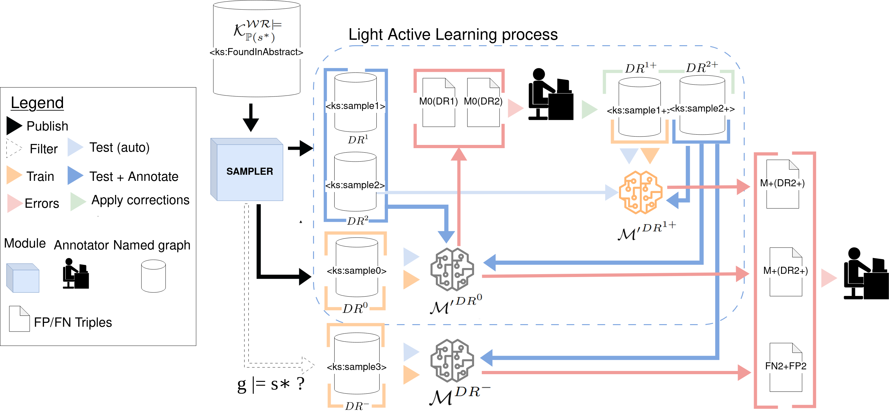

# KASTOR PROCESS

STEP 0- Initialize the Kastor KB: $\mathcal{K}$
[See the CORESE dir readMe](../corese#starting-from-scratch-data-base-initialization)


## Knowledge distillation

### KD-STEP 1-  Tag the entities related to the shape class: 

This step associates a random uuid to each entity related to dbo:class focused by the maximal shape chosen and having an abstract, it creates $\mathcal{K}_{\mathbb{P}(s^*)}$ . The dbo:Person shape is accessible here [PersonShape.ttl](../shapes/PersonShape.ttl)
```
python KD1_initializeKastorFromShape.py -s SHAPE_PATH
```
### KD-STEP 2-  Run inferences rules (optional):
This step is applying the rules defined by the user and create $\mathcal{G}^{\mathcal{R}\models}_{\mathbb{P}(s^*)}$, it uses SPARQL construct queries gathered into a rul file as described [here](https://files.inria.fr/corese/doc/rule.html)
```
 python KD2_inferencesRules.py -r RULES_PATH -m insert
```
### KD-STEP 3-  Wikicheck: 
This script check if the values of the datatype properties objects could be found in the Wikipedia abstracts, it creates $\mathcal{K}^{\mathcal{WR}\models}_{\mathbb{P}(s^*)}$
```
 python KD3_WikicheckNamedGraph.py -s SHAPE_PATH -ng SEARCHSPACE_NAMEDGRAPH
```
### KD-STEP 4 - The exemples-specific patterns 
This script is used to analyse the example-specific patterns set $\mathbb{P}_{\mathcal{K}}(s^*)$ 
```
 python KD4_getExampleSpecificPatternsStats.py -s SHAPE_PATH -output output_dir -ng named_graph_sample 
```
### KD-STEP 5-  Create a Random Sample
This script was used to create $DR^0$, $DR^1$, $DR^2$
```
 python KD5_CreateNewRandomSample.py -s SHAPE_PATH -sz 1200 
```
## KD-STEP 6-  Export a TurtleLight dataset for training a SLM
Export a previously create sample in TurtleLight datasets splitted in train/test/eval  
```
 python KD6_createTurtleLightdatasetFromNG.py -s SHAPE_PATH -output output_dir -ng named_graph_sample 
```

## Light Active SLM learning


# STEP LA0- Train a model
Please follow the instructions given in [SLM section](../slm/)

# STEP LA1- Test a model and retrieve errors
```
 python LA1-retrieveWbArtifacts.py 
```
The resulting *ToInspectTable.csv* file is dedicated to latter annotation 

# STEP 9- Annotate the FP/FN triples
add in 
verif	reason
