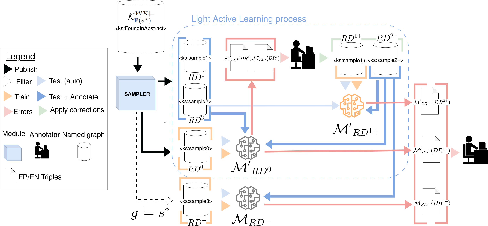

# KASTOR PROCESS

STEP 0- Initialize the Kastor KB: $\mathcal{K}$
[See the CORESE dir readMe](../corese#starting-from-scratch-data-base-initialization)


## Knowledge distillation

### KD-STEP 1-  Tag the entities related to the shape class: 

This step associates a random uuid to each entity related to dbo:class focused by the maximal shape chosen and having an abstract, it creates $\mathcal{K}_{\mathbb{P}(s^*)}$ . The dbo:Person shape is accessible here [PersonShape.ttl](../shapes/PersonShape.ttl)
```
python KD1_initializeKastorFromShape.py -s SHAPE_PATH
```
We can then get a sample of  $\mathcal{K}_{\mathbb{P}(s^*)}$ [with a SPARQL query](../corese/sparql_queries/get_sample_K_P_s_star.sparql)

### KD-STEP 2-  Run inferences rules (optional):
This step is applying the rules defined by the user and create $\mathcal{G}^{\mathcal{R}\models}_{\mathbb{P}(s^*)}$, it uses SPARQL construct queries gathered into a rul file as described [here](https://files.inria.fr/corese/doc/rule.html)
```
 python KD2_inferencesRules.py -r RULES_PATH -m insert
```
We applied in our case the following rules: 
$$dbo:deathDate \models dbo:deathYear$$ and  $$dbo:birthDate  \models dbo:birthYear$$ available in [./rules/Person_rules.rul](./rules/Person_rules.rul) file

We can then count the number of triples infered [ with a SPARQL query](../corese/sparql_queries/get_inferences_nb.sparql)

### KD-STEP 3-  Wikicheck: 
This script check if the values of the datatype properties objects could be found in the Wikipedia abstracts, it creates $\mathcal{K}^{\mathcal{WR}\models}_{\mathbb{P}(s^*)}$
```
 python KD3_WikicheckNamedGraph.py -s SHAPE_PATH -ng SEARCHSPACE_NAMEDGRAPH
```
We can then count the number of entities in $\mathcal{K}^{\mathcal{WR}\models}_{\mathbb{P}(s^*)}$ [ with a SPARQL query](../corese/sparql_queries/get_found_in_abstract_nb.sparql)

### KD-STEP 4 - The exemples-specific patterns 
This script is used to analyse the example-specific patterns set $\mathbb{P}_{\mathcal{K}}(s^*)$ 
```
 python KD4_getExampleSpecificPatternsStats.py -s SHAPE_PATH -output output_dir -ng named_graph_sample 
```
Result will be saved in [a csv file](./outputs/results_data/RDF_motif_foundNG_for_graph.csv); note that the given script could be also used on a sample level (see results on [DR0](./outputs/results_data/RDF_motif_sample_0.csv),DR2,DR-..) 

### KD-STEP 5-  Create a Random Sample
This script was used to create $DR^0$, $DR^1$, $DR^2$
```
 python KD5_CreateNewRandomSample.py -s SHAPE_PATH -sz 1200 
```
A sample can then be described with a [SPARQL query](../corese/sparql_queries/get_sample_nli_stats.sparql)

## KD-STEP 6-  Export a TurtleLight dataset for training a SLM
Export a previously create sample in TurtleLight datasets splitted in train/test/eval  
```
 python KD6_createTurtleLightdatasetFromNG.py -s SHAPE_PATH -output output_dir -ng named_graph_sample 
```

examples of samples produced is given in [DS_turtleS_0datatype_1inLine_1facto_train_sample.json](../samples/DS_turtleS_0datatype_1inLine_1facto_train_sample.json)

## Light Active SLM learning


### STEP LA0- Train a model
Please follow the instructions given in [SLM section](../slm/)

### STEP LA1- Test a model and retrieve errors
```
 python LA1-retrieveWbArtifacts.py  -wapik YOU_API_KEY -wuser YOUR_USER_NAME -wproj YOUR_WDB_PROJECT -wgroup YOUR_WDB_group -output /OUTPUT_DIR/
```
The resulting */OUTPUT_DIR/ToInspectTable.csv* file is dedicated to the latter annotation.


### STEP LA2- Annotate the FP/FN triples And Push the annotations to the KB

The */OUTPUT_DIR/ToInspectTable.csv* file contains two specifics columns dedicated to the annotation:
* The column "verif" is dedicated to classify as *TRUE* or *FALSE* classification. 
* The column "reason" allows the annotation given the typology of errors proposed in the paper
```
 python LA2-PushAnnotationsToKB.py   -s SHAPE_PATH -annot annotated_file -samp named_graph_sample 
```
